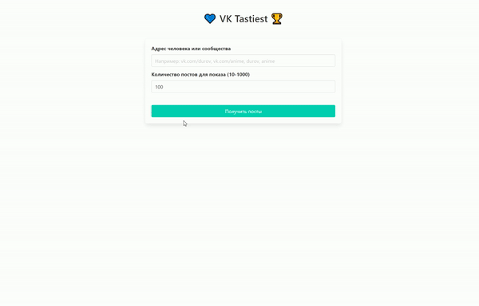

## 💙 VK Tastiest 🏆 - most-liked VK posts for group/person
Made to practice:
- FastAPI
- React
- synchronous and asynchronous requests
- asyncio handling
- PyTest (mocking, hypothesis, parametrized, coverage)
- .env handling 
- docker
- docker-compose
- deploying
- linux terminal
- PyCharm Pro features

<div align="center">
  <a href="http://vktastiest.ru">
    
  </a>
</div>

### Installation
1. Clone the repo.
   ```sh
   $ git clone git@github.com:a-burlakov/vk-tastiest.git
   ```
   
2. Open "vk-tastiest" directory.
   ```sh
   $ cd vk-tastiest
   ```

3. Create .env-file at `/backend/app/` with `VKAPI_TOKEN` variable. You can use mine:

   ```sh
   $ echo "VKAPI_TOKEN=ed52a625ed52a625ed52a6252eee461ffbeed52ed52a62589c8f057c4ad4cf28e7d8a73" > backend/app/.env
   ```

4. Run docker-compose.
   ```sh
   $ docker-compose up
   ```
   
5. Go to [localhost:80](http://localhost:80)